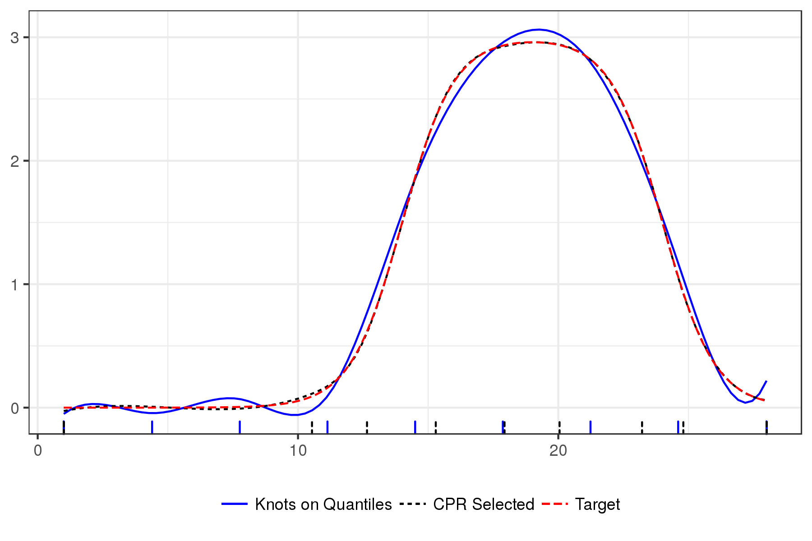

# Control Polygon Reduction
<aside class="gdbar">

</aside>

<div class="notes">
$$\newcommand{\bs}[1]{\boldsymbol{#1}}
\newcommand{\card}[1]{n\left(#1\right)}$$
</div>

## Introduction
- Consider the regression model
$$\bs{y} = f \left( \bs{x} \right) + \bs{Z}_{f}
  \bs{\beta} + \bs{Z}_{r} \bs{b} + \bs{\epsilon}$$

- Goals:
    - Model $f$ via uni-variable B-splines.
    - Regression model needs to be parsimonious (low degree of freedom).

- Challenges:
    - B-splines are defined by polynomial order and a knot sequences.
    - Given a loss function and polynomial order, no analytic solution exists for optimal a knot sequences.
    - Model selection need to be efficient, _i.e._, good fits, quickly.

## Quick B-spline Review

$$f(x) = \bs{B}_{k, \bs{\xi}} \left(x\right) \bs{\theta}_{\bs{\xi}} = \sum_{j=1}^{k = l}  \theta_{\bs{\xi}, j} B_{j, k, \bs{\xi}} \left(x\right)$$

- The matrix $\bs{B}_{k, \bs{\xi}} \left( x \right)$ is defined by de Boor's algorithm.
    - Polynomial order $k,$ (degree = $k -1$).
    - Knot sequences $\bs{\xi}$ with $k$-fold boundary knots and $l \geq 0$ interior knots.

- $\bs{\theta}_{\bs{\xi}}$ is a $\left(k + l\right) \times 1$ column vector of regression coefficients.

- Control Polygons: Convex hull for $\bs{B}_{k, \bs{\xi}} \left( x \right) \bs{\theta}_{\bs{\xi}}$

$$CP_{k, \bs{\xi}, \bs{\theta}_{\bs{\xi}}} = \left\{ \left( \xi_{j}^{*}, \theta_{\bs{\xi}, j} \right) \right\}_{j=1}^{n\left(\bs{\xi}\right) - k}, \quad \xi_{j}^{*} = \frac{1}{k-1} \sum_{i = 1}^{k-1} \xi_{j + i}$$

## Example B-spline Basis and Spline function
```{r eg_bmat}
bmat <- bsplines(x = seq(0, 6, length = 500), iknots = c(1.0, 1.5, 2.3, 4.0, 4.5))
theta <- c(1, 0, 3.5, 4.2, 3.7, -0.5, -0.7, 2, 1.5)
eg_cp <- cp(bmat, theta)
```

<div style="width: 100%; display: table;">
  <div style="display: table-row">
  <div style="display: table-cell; vertical-align: top;">
```{r eg_basis_plot, fig.width = 3.0, fig.height = 2.6, fig.show = "hold"}
plot(bmat)
#
#
#
```
  </div>
  <div style="display: table-cell; vertical-align: top;">
  
  </div>
  <div style="display: table-cell; vertical-align: top;">
```{r eg_spline_plot, fig.width = 6.5, fig.height = 2.6}
grid.arrange(plot(eg_cp, show_spline = TRUE, show_cp = FALSE),
             plot(eg_cp),
             plot(eg_cp, show_spline = TRUE),
             nrow = 1)
```
  </div>
  </div>
</div>

## Control Polygon Reduction (CPR)
- General Idea
    - Assume that $f\left(x\right)$ can be adequately modeled by $\bs{B}_{k, \bs{\xi}} \left( x \right) \bs{\theta}_{\bs{\xi}}$.
    - Start search for $\bs{\xi}$ within a larger sequence $\bs{\xi} \cup \bs{\xi}'.$

<br>

- CPR is a backward-step model selection process.
- Remove the least influential knot at each step.

<br>

- Need a metric for assessing the influence of a knot.

## Assessing the Influence of a Knot

<div style="width: 100%; display: table;">
  <div style="display: table-row">
  <div style="width: 600px; display: table-cell; vertical-align: top;">
- Add elements to the knot sequence without affecting the spline function (Boehm 1980).

- Specifically, for $\bs{\xi} \text{ and } \bs{\xi} \cup \xi',$

$$\bs{B}_{k, \bs{\xi}}\left(x \right) \bs{\theta}_{\bs{\xi}} = \bs{B}_{k, \bs{\xi} \cup \xi'}\left(x \right) \bs{\theta}_{\bs{\xi} \cup \xi'}$$

- The relationship between $\bs{\theta}_{\bs{\xi}\cup\xi'}$ and $\bs{\theta}_{\bs{\xi}}$ is defined by a lower bi-diagonal matrix
$$\bs{\theta}_{\bs{\xi}\cup\xi'} = \bs{W}_{k, \bs{\xi}} \left( \xi' \right) \bs{\theta}_{\bs{\xi}}$$

  </div>
  <div style="display: table-cell; vertical-align: top;">
```{r boehm, echo = FALSE, fig.width = 4, fig.height = 4}
bmat_boehm  <- update_bsplines(bmat, iknots = sort(c(attr(bmat, "iknots"), 2.0)))
theta_boehm <- insertion_matrix(2.0, attr(bmat, "xi")) %*% theta
plot(cp(bmat, theta), cp(bmat_boehm, theta_boehm), show_spline = TRUE, color = TRUE) +
  theme(legend.position = "none")
```
  </div>
  </div>
</div>

```{r boehm2, ref.label = "boehm", echo = TRUE, eval = FALSE}
```

## Influence Weight, $w_j$, of $\xi_j \in \bs{\xi}$ on $\bs{B}_{k, \bs{\xi}}\left(x\right) \bs{\theta}_{\bs{\xi}}$

<script>
  function check_value(fieldvalue) {
    switch (fieldvalue) {
      case 1:
        document.getElementById("imagedest").innerHTML = "";
        break;
      case 2:
        document.getElementById("imagedest").innerHTML = "";
        break;
      case 3:
        document.getElementById("imagedest").innerHTML = "";
        break;
      case 4:
        document.getElementById("imagedest").innerHTML = "";
        break;
      case 5:
        document.getElementById("imagedest").innerHTML = "";
        break;
      default:
        document.getElementById("imagedest").innerHTML = "";
    }
  }
</script>

<form name="builder">
<table cellpadding=10>
<tr>
  <td width=200px> Original CP &nbsp; &nbsp; </td>
  <td width=350px> Influence of $\xi_6$ </td>
  <td width=350px> Influence of $\xi_8$ </td>
</tr>
<tr>
  <td> <input type="radio" name="field" value=1 onclick='check_value(1)' checked="checked"/> $CP_{k, \bs{\xi}, \bs{\theta}_{\bs{\xi}}}$ </td>
  <td> <input type="radio" name="field" value=2 onclick='check_value(2)' /> $CP_{k, \bs{\xi}\backslash \xi_6, \bs{\theta}_{\bs{\xi}\backslash \xi_6}}$ </td>
  <td> <input type="radio" name="field" value=4 onclick='check_value(4)' /> $CP_{k, \bs{\xi}\backslash \xi_8, \bs{\theta}_{\bs{\xi}\backslash \xi_8}}$ </td>
</tr>
<tr>
  <td> </td>
  <td> <input type="radio" name="field" value=3 onclick='check_value(3)' /> $CP_{k, \left(\bs{\xi}\backslash \xi_6\right) \cup \xi_6, \bs{\theta}_{\left(\bs{\xi}\backslash \xi_6\right) \cup \xi_6}}$ </td>
  <td> <input type="radio" name="field" value=5 onclick='check_value(5)' /> $CP_{k, \left(\bs{\xi}\backslash \xi_8\right) \cup \xi_8, \bs{\theta}_{\left(\bs{\xi}\backslash \xi_8\right) \cup \xi_8}}$ </td>
</tr>
</table>
</form>

<hr>

<div style="width: 100%; display: table;">
  <div style="display: table-row">
  <div id="imagedest" style="width: 600px; display: table-cell; vertical-align: top;">
  
  </div>
  <div id="influence" style="display: table-cell; vertical-align: top;">

<font size=4>

$$
\begin{split}
\bs{\theta}_{\bs{\xi}\backslash \xi_j} &= \left( \bs{W}^{T} \bs{W} \right)^{-1} \bs{W}^{T} \bs{\theta}_{\bs{\xi}} \\ \\
\bs{\theta}_{\left(\bs{\xi}\backslash \xi_j\right) \cup \xi_j} &= \bs{W} \bs{\theta}_{\bs{\xi}\backslash \xi_j} \\
&= \bs{W} \left( \bs{W}^{T} \bs{W} \right)^{-1} \bs{W}^{T} \bs{\theta}_{\bs{\xi}} \\ \\
w_{j} &= \left\lVert \bs{\theta}_{\bs{\xi}} - \bs{\theta}_{ \left(\bs{\xi} \backslash \xi_j \right) \cup \xi_j} \right\rVert_2 \\
      &= \left\lVert \left( \bs{I} - \bs{W} \left( \bs{W}^T \bs{W} \right)^{-1} \bs{W}^T\right) \bs{\theta}_{\bs{\xi}} \right\rVert_2.
\end{split}
$$

$w_{6} = 0.539, \quad w_{8} = 0.278$
</font>
  </div>
  </div>
</div>


<div style="position: absolute; right: 0px; bottom: 0px;">

</div>
<div class="notes">
```{r}
influence_of(eg_cp)
```
</div>

## The Control Polygon Reduction Algorithm
1. Start with a high cardinal knot sequences, say $L = 50,$ and set $l = L$ to index models.
2. Use an appropriate regression modeling approach to estimate the control polygon ordinates.
3. Construct the control polygon for the current $\bs{\xi}_{l}$ and $\bs{\theta}_{\bs{\xi}_{l}}$ estimate.
4. Use $CP_{k, \bs{\xi}_{l}, \bs{\theta}_{\bs{\xi}_l}}$ and find the influence weight for all internal knots.
5. Coarsen the knot sequence by removing the knot with the smallest influence weight.
6. Refit the regression model using the coarsened knot sequence and index $l = l - 1.$
7. Repeat steps 3 through 6 until all
  internal knots have been removed, _i.e._, if $l \geq 0$ go to 3, else go to 8.
8. Select the preferable model by visual inspection of diagnostic graphics.

## Idealized CPR Example

<iframe src="fdat_cpr_run.html"></iframe>

<div style="position: absolute; right: 0px; bottom: 0px;">

</div>
<div class="notes">

</div>

## Selected Simulation Results

<div style="width: 100%; display: table;">
  <div style="display: table-row">
  <div style="display: table-cell; vertical-align: top;">
<!-- -->
  </div>
  <div style="display: table-cell; vertical-align: top;">
  Median Time to Evaluate OLS
<table>
 <thead>
  <tr>
   <th style="text-align:left;"> method </th>
   <th style="text-align:right;"> Seconds </th>
  </tr>
 </thead>
<tbody>
  <tr>
   <td style="text-align:left;"> Bkwd </td>
   <td style="text-align:right;"> 33.4625 </td>
  </tr>
  <tr>
   <td style="text-align:left;"> CPR </td>
   <td style="text-align:right;"> 5.4940 </td>
  </tr>
  <tr>
   <td style="text-align:left;"> Frwd </td>
   <td style="text-align:right;"> 4.6250 </td>
  </tr>
  <tr>
   <td style="text-align:left;"> PSLN </td>
   <td style="text-align:right;"> 3.9185 </td>
  </tr>
</tbody>
</table>
<br>

  Median Time to Evaluate Mixed Effect Model
<table>
 <thead>
  <tr>
   <th style="text-align:left;"> method </th>
   <th style="text-align:right;"> Seconds </th>
  </tr>
 </thead>
<tbody>
  <tr>
   <td style="text-align:left;"> Bkwd </td>
   <td style="text-align:right;"> 3542.3490 </td>
  </tr>
  <tr>
   <td style="text-align:left;"> CPR </td>
   <td style="text-align:right;"> 80.6855 </td>
  </tr>
  <tr>
   <td style="text-align:left;"> Frwd </td>
   <td style="text-align:right;"> 80.5255 </td>
  </tr>
  <tr>
   <td style="text-align:left;"> PSLN </td>
   <td style="text-align:right;"> 350.6555 </td>
  </tr>
</tbody>
</table>
  </div>
  </div>
</div>

## Control Polygon Reduction | Conclusions

- CPR is capable of identifying high quality of fit, parsimonious B-spline regression models, quickly.

- Added bonuses of having a quick algorithm: Able to search over polynomial order.

- Knots, by being in "good" locations, might have meaningful interpretations.

- The CPR method generalizes to multi-variable B-splines via Control Net Reduction.
