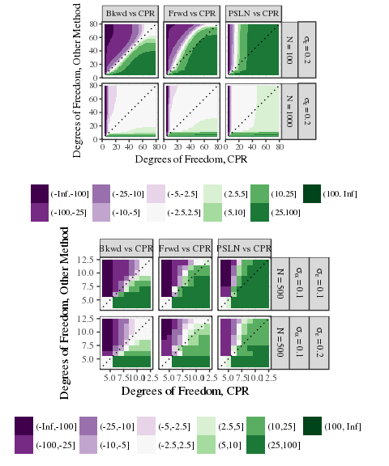

# Control Polygon Reduction
<aside class="gdbar">

</aside>

<div class="notes">
$$\newcommand{\bs}[1]{\boldsymbol{#1}}
\newcommand{\card}[1]{n\left(#1\right)}$$
</div>

## Introduction
- Consider the regression model
$$\bs{y} = f \left( \bs{x} \right) + \bs{Z}_{f}
  \bs{\beta} + \bs{Z}_{r} \bs{b} + \bs{\epsilon}$$

- Goals:
    - Model $f$ via uni-variable B-splines.
    - Regression model needs to be parsimonious (low degree of freedom).

- Challenges:
    - B-splines are defined by polynomial order and a knot sequences.
    - Given a loss function and polynomial order, no analytic solution exists for optimal a knot sequences.
    - Model selection need to be efficient, _i.e._, good fits, quickly.

## Quick B-spline Review

$$f(x) = \bs{B}_{k, \bs{\xi}} \left(x\right) \bs{\theta}_{\bs{\xi}} = \sum_{j=1}^{k = l}  \theta_{\bs{\xi}, j} B_{j, k, \bs{\xi}} \left(x\right)$$

- The matrix $\bs{B}_{k, \bs{\xi}} \left( x \right)$ is defined by de Boor's algorithm.
    - Polynomial order $k,$ (degree = $k -1$).
    - Knot sequences $\bs{\xi}$ with $k$-fold boundary knots and $l \geq 0$ interior knots.

- $\bs{\theta}_{\bs{\xi}}$ is a $\left(k + l\right) \times 1$ column vector of regression coefficients.

- Control Polygons: Convex hull for $\bs{B}_{k, \bs{\xi}} \left( x \right) \bs{\theta}_{\bs{\xi}}$

$$CP_{k, \bs{\xi}, \bs{\theta}_{\bs{\xi}}} = \left\{ \left( \xi_{j}^{*}, \theta_{\bs{\xi}, j} \right) \right\}_{j=1}^{n\left(\bs{\xi}\right) - k}, \quad \xi_{j}^{*} = \frac{1}{k-1} \sum_{i = 1}^{k-1} \xi_{j + i}$$

## Example B-spline Basis and Spline function
```{r eg_bmat}
bmat <- bsplines(x = seq(0, 6, length = 500), iknots = c(1.0, 1.5, 2.3, 4.0, 4.5))
theta <- c(1, 0, 3.5, 4.2, 3.7, -0.5, -0.7, 2, 1.5)
eg_cp <- cp(bmat, theta)
```

<div style="width: 100%; display: table;">
  <div style="display: table-row">
  <div style="display: table-cell; vertical-align: top;">
```{r eg_basis_plot, fig.width = 3.0, fig.height = 2.6, fig.show = "hold"}
plot(bmat)
#
#
#
```
  </div>
  <div style="display: table-cell; vertical-align: top;">
  
  </div>
  <div style="display: table-cell; vertical-align: top;">
```{r eg_spline_plot, fig.width = 6.5, fig.height = 2.6}
grid.arrange(plot(eg_cp, show_spline = TRUE, show_cp = FALSE),
             plot(eg_cp),
             plot(eg_cp, show_spline = TRUE),
             nrow = 1)
```
  </div>
  </div>
</div>

## Control Polygon Reduction (CPR)
- General Idea
    - Assume that $f\left(x\right)$ can be adequately modeled by $\bs{B}_{k, \bs{\xi}} \left( x \right) \bs{\theta}_{\bs{\xi}}$.
    - Start search for $\bs{\xi}$ within a larger sequence $\bs{\xi} \cup \bs{\xi}'.$

<br>

- CPR is a backward-step model selection process.
- Remove the least influential knot at each step.

<br>

- Metric for knot influence based changes in the control polygon.
- Sum of the squared distance between control vertex ordinates.
- More details in appendix slides.

## Idealized CPR Example

<iframe src="fdat_cpr_run.html"></iframe>

<div style="position: absolute; right: 0px; bottom: 0px;">

</div>
<div class="notes">

</div>

## Selected Simulation Results

<div style="width: 100%; display: table;">
  <div style="display: table-row">
  <div style="display: table-cell; vertical-align: top;">
<!-- -->
  </div>
  <div style="display: table-cell; vertical-align: top;">
  Median Time to Evaluate OLS
<table>
 <thead>
  <tr>
   <th style="text-align:left;"> method </th>
   <th style="text-align:right;"> Seconds </th>
  </tr>
 </thead>
<tbody>
  <tr>
   <td style="text-align:left;"> Bkwd </td>
   <td style="text-align:right;"> 33.4625 </td>
  </tr>
  <tr>
   <td style="text-align:left;"> CPR </td>
   <td style="text-align:right;"> 5.4940 </td>
  </tr>
  <tr>
   <td style="text-align:left;"> Frwd </td>
   <td style="text-align:right;"> 4.6250 </td>
  </tr>
  <tr>
   <td style="text-align:left;"> PSLN </td>
   <td style="text-align:right;"> 3.9185 </td>
  </tr>
</tbody>
</table>
<br>

  Median Time to Evaluate Mixed Effect Model
<table>
 <thead>
  <tr>
   <th style="text-align:left;"> method </th>
   <th style="text-align:right;"> Seconds </th>
  </tr>
 </thead>
<tbody>
  <tr>
   <td style="text-align:left;"> Bkwd </td>
   <td style="text-align:right;"> 3542.3490 </td>
  </tr>
  <tr>
   <td style="text-align:left;"> CPR </td>
   <td style="text-align:right;"> 80.6855 </td>
  </tr>
  <tr>
   <td style="text-align:left;"> Frwd </td>
   <td style="text-align:right;"> 80.5255 </td>
  </tr>
  <tr>
   <td style="text-align:left;"> PSLN </td>
   <td style="text-align:right;"> 350.6555 </td>
  </tr>
</tbody>
</table>
  </div>
  </div>
</div>

## Control Polygon Reduction | Conclusions

- CPR is capable of identifying high quality of fit, parsimonious B-spline regression models, quickly.

- Added bonuses of having a quick algorithm: Able to search over polynomial order.

- Knots, by being in "good" locations, might have meaningful interpretations.

- The CPR method generalizes to multi-variable B-splines via Control Net Reduction.
