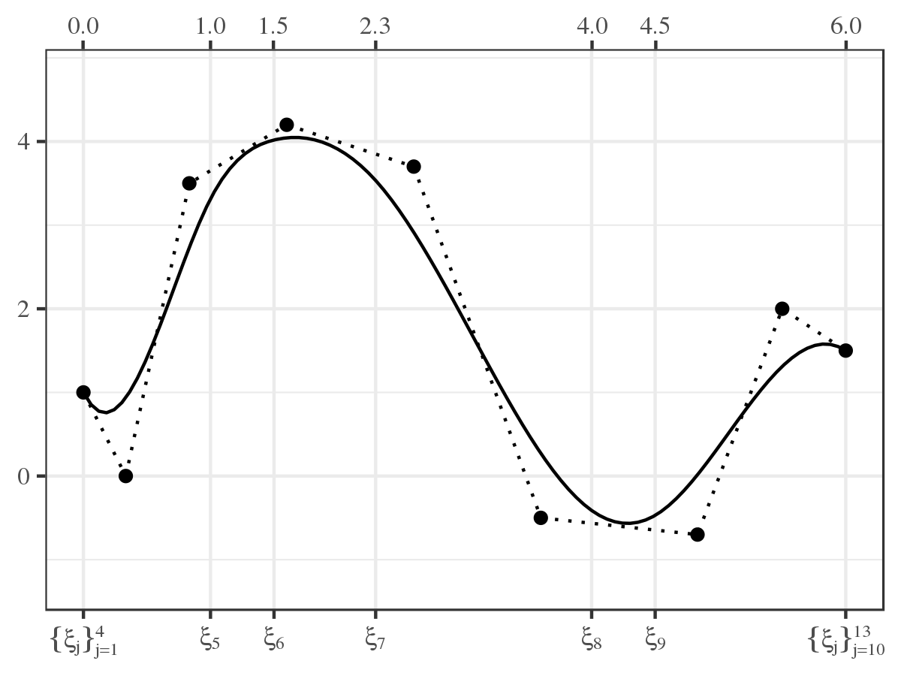
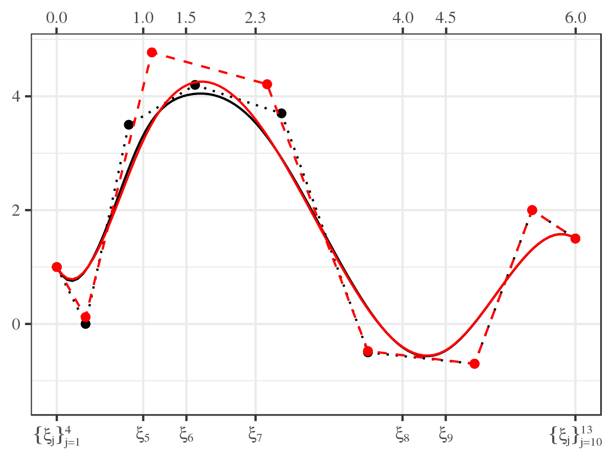
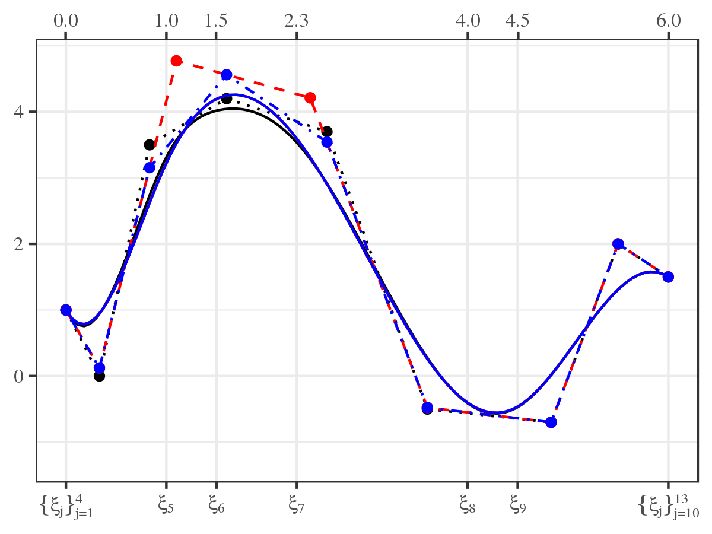
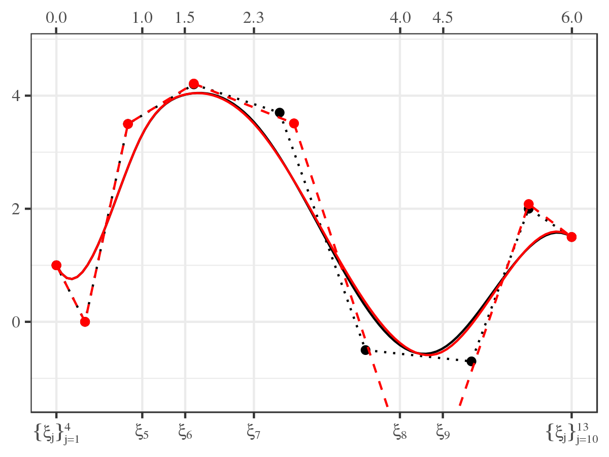
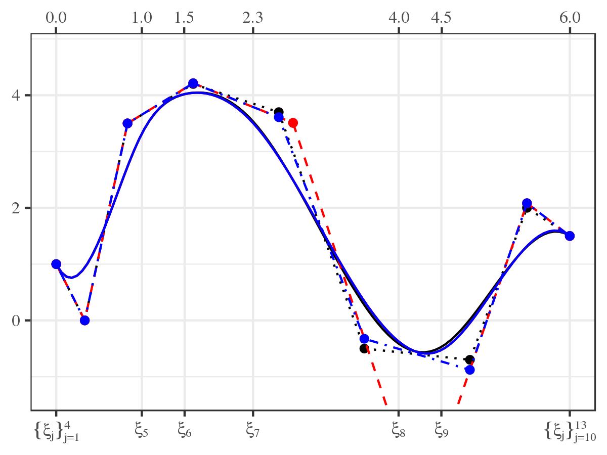

## Assessing the Influence of a Knot

<div style="width: 100%; display: table;">
  <div style="display: table-row">
  <div style="width: 600px; display: table-cell; vertical-align: top;">
- Add elements to the knot sequence without affecting the spline function (Boehm 1980).

- Specifically, for $\bs{\xi} \text{ and } \bs{\xi} \cup \xi',$

$$\bs{B}_{k, \bs{\xi}}\left(x \right) \bs{\theta}_{\bs{\xi}} = \bs{B}_{k, \bs{\xi} \cup \xi'}\left(x \right) \bs{\theta}_{\bs{\xi} \cup \xi'}$$

- The relationship between $\bs{\theta}_{\bs{\xi}\cup\xi'}$ and $\bs{\theta}_{\bs{\xi}}$ is defined by a lower bi-diagonal matrix
$$\bs{\theta}_{\bs{\xi}\cup\xi'} = \bs{W}_{k, \bs{\xi}} \left( \xi' \right) \bs{\theta}_{\bs{\xi}}$$

  </div>
  <div style="display: table-cell; vertical-align: top;">
```{r boehm, echo = FALSE, fig.width = 4, fig.height = 4}
bmat_boehm  <- update_bsplines(bmat, iknots = sort(c(attr(bmat, "iknots"), 2.0)))
theta_boehm <- insertion_matrix(2.0, attr(bmat, "xi")) %*% theta
plot(cp(bmat, theta), cp(bmat_boehm, theta_boehm), show_spline = TRUE, color = TRUE) +
  theme(legend.position = "none")
```
  </div>
  </div>
</div>

```{r boehm2, ref.label = "boehm", echo = TRUE, eval = FALSE}
```

## Influence Weight, $w_j$, of $\xi_j \in \bs{\xi}$ on $\bs{B}_{k, \bs{\xi}}\left(x\right) \bs{\theta}_{\bs{\xi}}$

<script>
  function check_value(fieldvalue) {
    switch (fieldvalue) {
      case 1:
        document.getElementById("imagedest").innerHTML = "";
        break;
      case 2:
        document.getElementById("imagedest").innerHTML = "";
        break;
      case 3:
        document.getElementById("imagedest").innerHTML = "";
        break;
      case 4:
        document.getElementById("imagedest").innerHTML = "";
        break;
      case 5:
        document.getElementById("imagedest").innerHTML = "";
        break;
      default:
        document.getElementById("imagedest").innerHTML = "";
    }
  }
</script>

<form name="builder">
<table cellpadding=10>
<tr>
  <td width=200px> Original CP &nbsp; &nbsp; </td>
  <td width=350px> Influence of $\xi_6$ </td>
  <td width=350px> Influence of $\xi_8$ </td>
</tr>
<tr>
  <td> <input type="radio" name="field" value=1 onclick='check_value(1)' checked="checked"/> $CP_{k, \bs{\xi}, \bs{\theta}_{\bs{\xi}}}$ </td>
  <td> <input type="radio" name="field" value=2 onclick='check_value(2)' /> $CP_{k, \bs{\xi}\backslash \xi_6, \bs{\theta}_{\bs{\xi}\backslash \xi_6}}$ </td>
  <td> <input type="radio" name="field" value=4 onclick='check_value(4)' /> $CP_{k, \bs{\xi}\backslash \xi_8, \bs{\theta}_{\bs{\xi}\backslash \xi_8}}$ </td>
</tr>
<tr>
  <td> </td>
  <td> <input type="radio" name="field" value=3 onclick='check_value(3)' /> $CP_{k, \left(\bs{\xi}\backslash \xi_6\right) \cup \xi_6, \bs{\theta}_{\left(\bs{\xi}\backslash \xi_6\right) \cup \xi_6}}$ </td>
  <td> <input type="radio" name="field" value=5 onclick='check_value(5)' /> $CP_{k, \left(\bs{\xi}\backslash \xi_8\right) \cup \xi_8, \bs{\theta}_{\left(\bs{\xi}\backslash \xi_8\right) \cup \xi_8}}$ </td>
</tr>
</table>
</form>

<hr>

<div style="width: 100%; display: table;">
  <div style="display: table-row">
  <div id="imagedest" style="width: 600px; display: table-cell; vertical-align: top;">
  
  </div>
  <div id="influence" style="display: table-cell; vertical-align: top;">

<font size=4>

$$
\begin{split}
\bs{\theta}_{\bs{\xi}\backslash \xi_j} &= \left( \bs{W}^{T} \bs{W} \right)^{-1} \bs{W}^{T} \bs{\theta}_{\bs{\xi}} \\ \\
\bs{\theta}_{\left(\bs{\xi}\backslash \xi_j\right) \cup \xi_j} &= \bs{W} \bs{\theta}_{\bs{\xi}\backslash \xi_j} \\
&= \bs{W} \left( \bs{W}^{T} \bs{W} \right)^{-1} \bs{W}^{T} \bs{\theta}_{\bs{\xi}} \\ \\
w_{j} &= \left\lVert \bs{\theta}_{\bs{\xi}} - \bs{\theta}_{ \left(\bs{\xi} \backslash \xi_j \right) \cup \xi_j} \right\rVert_2 \\
      &= \left\lVert \left( \bs{I} - \bs{W} \left( \bs{W}^T \bs{W} \right)^{-1} \bs{W}^T\right) \bs{\theta}_{\bs{\xi}} \right\rVert_2.
\end{split}
$$

$w_{6} = 0.539, \quad w_{8} = 0.278$
</font>
  </div>
  </div>
</div>


<div style="position: absolute; right: 0px; bottom: 0px;">

</div>
<div class="notes">
```{r}
influence_of(eg_cp)
```
</div>

## The Control Polygon Reduction Algorithm
1. Start with a high cardinal knot sequences, say $L = 50,$ and set $l = L$ to index models.
2. Use an appropriate regression modeling approach to estimate the control polygon ordinates.
3. Construct the control polygon for the current $\bs{\xi}_{l}$ and $\bs{\theta}_{\bs{\xi}_{l}}$ estimate.
4. Use $CP_{k, \bs{\xi}_{l}, \bs{\theta}_{\bs{\xi}_l}}$ and find the influence weight for all internal knots.
5. Coarsen the knot sequence by removing the knot with the smallest influence weight.
6. Refit the regression model using the coarsened knot sequence and index $l = l - 1.$
7. Repeat steps 3 through 6 until all
  internal knots have been removed, _i.e._, if $l \geq 0$ go to 3, else go to 8.
8. Select the preferable model by visual inspection of diagnostic graphics.
